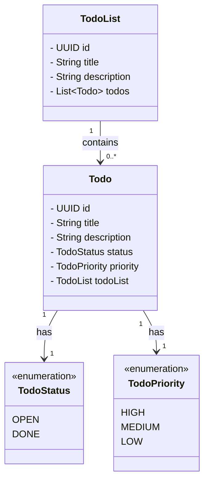

# VueDoList Backend

This is the backend service for the [VueDoList](https://github.com/Fabinatix97/vuedolist) application. Built with Spring Boot and PostgreSQL, it provides a clean RESTful API for managing to-do lists, todos, and settings.

## Features

- **RESTful API** for CRUD operations on lists and todos
- **Environment-based configuration** for secure local dev & deployment
- **PostgreSQL integration** via Spring Data JPA
- **CORS setup** for frontend-backend communication
- **Dockerized DB support** for easy local setup

## Technologies Used

- **Backend**: [Spring Boot](https://spring.io/projects/spring-boot)
- **Database**: [PostgreSQL](https://www.postgresql.org/)
- **Build Tool**: Maven

## Getting Started

### Prerequisites
- Java 21+
- Maven 3+
- Docker (for PostgreSQL setup)

### Clone the repository

```bash
git clone https://github.com/Fabinatix97/vuedoapi.git
cd vuedoapi
```

## API Design

Type     | Route | Function
---------|-------|---------
`GET`    | /todo-lists | List all todo lists
`POST`   | /todo-lists | Create a todo list
`GET`    | /todo-lists/{todo_list_id} | Get a specific todo list
`PUT`    | /todo-lists/{todo_list_id} | Fully update a todo list
`PATCH`  | /todo-lists/{todo_list_id} | Partially update a todo list
`DELETE` | /todo-lists/{todo_list_id} | Delete a todo list
`GET`    | /todo-lists/{todo_list_id}/todos | List all todos
`POST`   | /todo-lists/{todo_list_id}/todos | Create a todo
`GET`    | /todo-lists/{todo_list_id}/todos/{todo_id} | Get a specific todo
`PATCH`  | /todo-lists/{todo_list_id}/todos/{todo_id} | Partially update a todo
`PUT`    | /todo-lists/{todo_list_id}/todos/{todo_id} | Fully update a todo
`DELETE` | /todo-lists/{todo_list_id}/todos/{todo_id} | Delete a todo

## Domain


